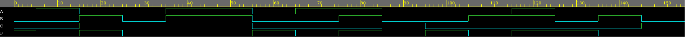
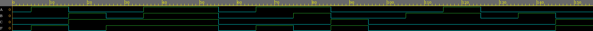

# HW1.1
Write the Verilog models and testbenches of the following Boolean expressions. Provide your code and simulation results.

a.(10 pts) F(A,B,C) = A’B’C’ + A’BC + AB’C + ABC’

Simulation results are as follows :

  

b.(10 pts) F(A,B,C) = ABC + AB’C + AB’C’ + A’B’C

Simulation results are as follows :

  

