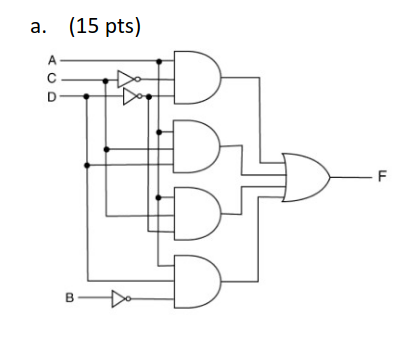
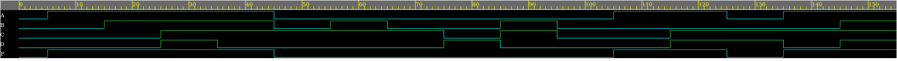
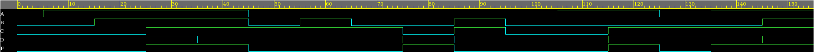

# HW1.2
2. Write the Verilog models and testbenches of the following logic circuits. Provide your code and
simulation results.

  

Simulation results are as follows :

  

  

Simulation results are as follows :

  

