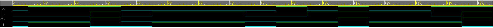
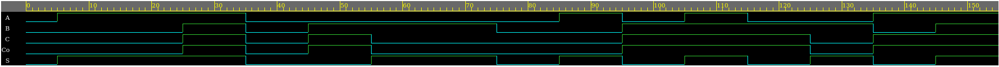
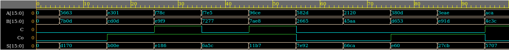

# HW1.3
3. Write the Verilog models and testbenches of the following logic circuits, use hierarchical and modular
approach whenever possible, you can re-use your designs. Provide your code and simulation results for
each.

a. (10) 1-bit half adder module HA(S, Co, A, B), with inputs A, B, (numbers to add) outputs S, Co (Sum,
Carry out)

  

b. (10) 1-bit full adder module using half adders FA(S, Co, A, B, C) with inputs A, B, C (A, B are numbers
and C is the carry input) outputs S, Co (Sum, Carry out)

  

c. (30) 16-bit Ripple Carry Adder module using full adders RCA (S, Co, A, B, C) with inputs A, B, C (A, B are
numbers and C is the Carry input) outputs S, Co (Sum, Carry out). All vectors should be in little-endian
format.

  

